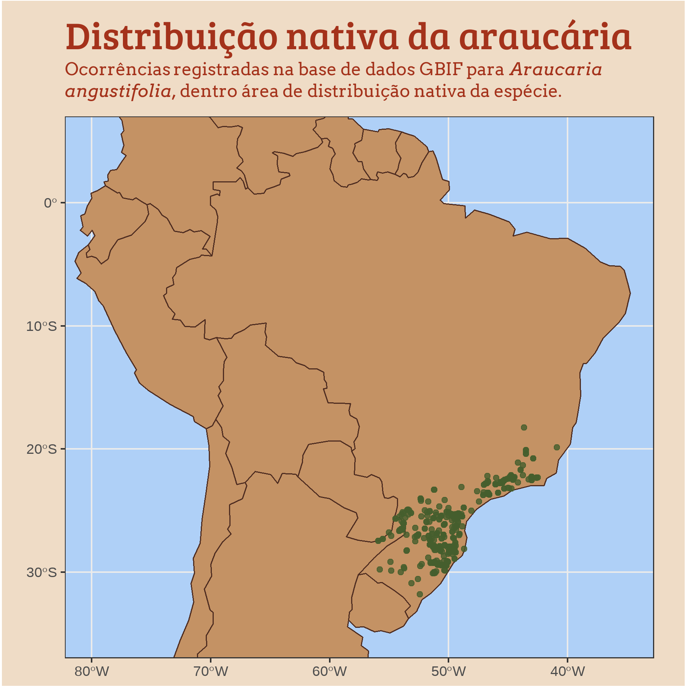
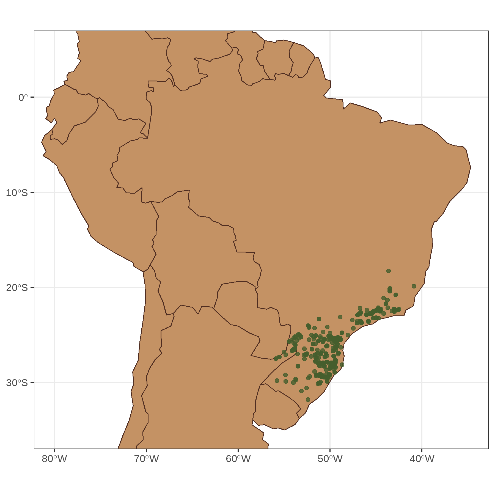
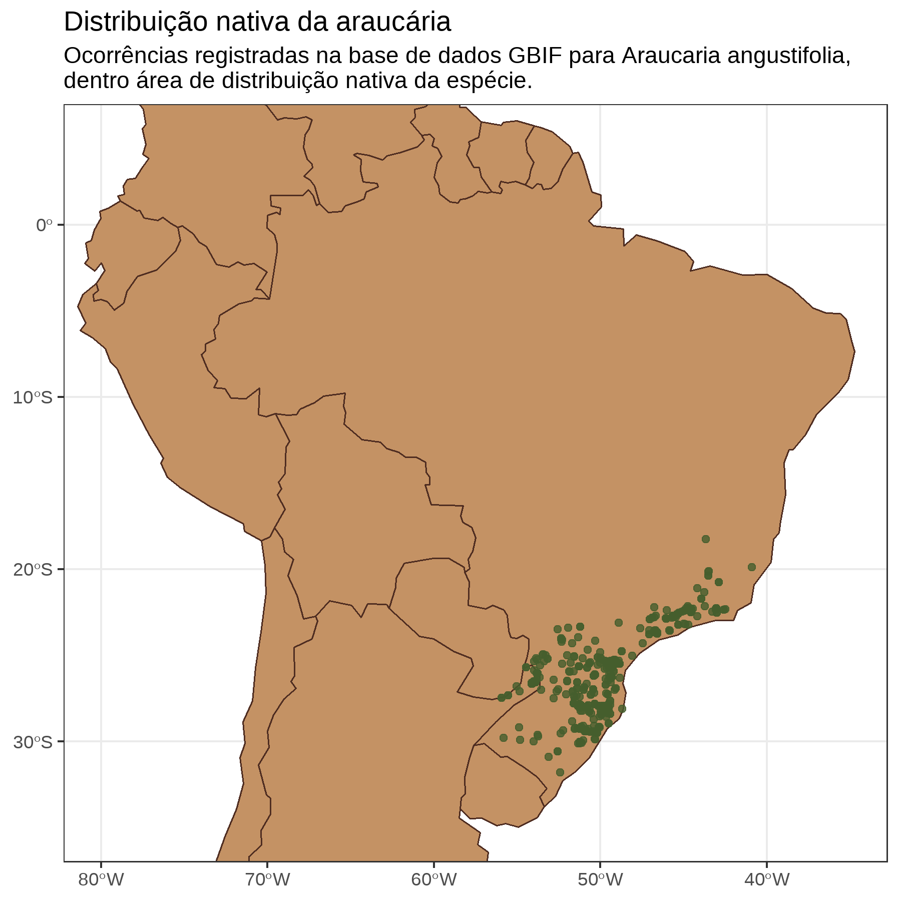

```{r setup, include=FALSE}
knitr::opts_chunk$set(echo = T)
```

# Sobre a série

Vou publicar uma série de textos explorando algumas ferramentas para produção de mapas com o R. A ideia é explorar principalmete os pacotes `{sf}` e `{terra}`, que tendem a ser substitutos para os pacotes `{sp}` e `{raster}`. 

Ao longo das postagens, irei abordar tópicos de aquisição e manipulação de dados espaciais, além de gerar visualizações com diferentes pacotes, como o `{ggplot2}`, `{tmap}`, `{leaflet}` e `{cartography}`. 

Esta série irá conter 10 postagens, que serão publicadas semanalmente. Nelas pretendo explorar de maneira didática a construção de cada mapa. Minha inspiração para a construção desta série de textos é o desafio #30daysmapchallenge. O desafio propõe a postagem de um mapa por dia no twitter, cada dia tendo um tema específico. Inspirado nesses temas, construí alguns mapas e que serão apresentados em forma de texto/tutorial. 

**lista de  tópicos de cada postagem ou título previo**

Nessa primeria postagem iremos consruir um mapa de pontos. Para isso, escolhi montar um mapa de registros de ocorrência de *Araucaria angustifolia*. Bora lá!

# Mapeando a Araucária 

A Araucária ([*Araucaria angustifolia*](https://pt.wikipedia.org/wiki/Arauc%C3%A1ria)) é uma espécie emblemática do sul do Brasil. Ela ocorre desde o Planalto catarinense até picos da Serra da Mantiqueira no estado de Minas Gerais. É uma espécie de grande importância comercial, tanto por sua madeira quanto pelo seu fruto, o pinhão. 

```{r, echo=FALSE, fig.cap="Foto por Bruno Salvani via unsplash"}

knitr::include_graphics("bruno-salvini-M6igzF_7taw-unsplash.jpg")
```


## Carregando os pacotes {#pacotes}

Primeiro, vou carregar todos os pacotes que serão utilizados ao longo do tutorial. Nos meus scripts, costumo organizar dessa forma: todos os pacotes o ínicio. E enquanto vou escrevendo o código, sempre que preciso de um novo pacote, incluio o carregamento dele no início do script. Assim, quando eu for utilizar o script novamente, todos os pacotes serão carregados antes de começar as análises. 

```{r}
# carregar pacotes --------------------

library(rgbif) # baixar ocorrencias do gbif
library(sf) # manipulação de dados espaciais
library(rnaturalearth) # fonte de mapas
library(tidyverse) # manipulação e visualização de dados
library(showtext) # para carregar fontes do https://fonts.google.com/
library(ggtext) # configurar visualização de texto no ggplot 
```

## Baixando os dados de ocorrência 

Vou baixar todos os registros de ocorrências de araucária da base de dados do [Global Biodiversity Information Facility (GBIF)](https://www.gbif.org/) utilizandoo pacote `{rgbif}`. Na função `occ_search()`, informei o nome da espécie e o limite de registros que a função deve retornar. Essa função tem como padrão retornar até 500 occorrências (argumento `limit = 500`). Primeiro utilizei a função informando apenas a espécie. Ela então retorna também , e depois alterei o `limit` pois a função retorna também quantas ocorrecias estão disponiveis. 

Para o nosso objetivo de praticar a construção de mapas, podemos utilizar apenas os dados baixados com a função `occ_search()`. Caso você deseje baixar dados para alguma publicação oficial, é recomendavel que utilize a função `occ_download()`, que gera um arquivo de download com um identificador DOI ([Digital Object Identifier](https://en.wikipedia.org/wiki/Digital_object_identifier)). 


```{r}
# baixar ocorrencias ------------

araucaria.gbif <- occ_search(
  scientificName = "Araucaria angustifolia",
  limit = 2000
  )

nrow(araucaria.gbif$data)

```

Há 1524 ocorrências de araucária no GBIF. Mas nem todas essas ocorrências possuem coordenadas geográficas. Vamos limpar os dados para manter apenas os registros com coordenadas usando a função `drop_na()` do `{dplyr}`. 

```{r}
# remove registros sem coordenadas

araucaria <- 
araucaria.gbif$data %>% 
  drop_na(decimalLongitude, decimalLatitude)

nrow(araucaria)
```

Restaram 683 ocorrências com coordenadas geográficas. Agora, vamos fazer um mapa bem simples apenas para conferir como estão distribuídas as ocorrências. Aqui, vou utilizar um obejto com os polígonos dos paises do mundo, disponibilizados pelo pacote {`rnauralearth`}. O objeto chama-se `countries110`, e é da classe `SpatialPolygonsDataFrame`. Vou tranformá-lo para classe `sf` para gerar o mapa com o `{ggplot2}`. Além disso, vou transformar os dados de ocorrência para classe `sf` e definir a projeção geográfica igual a do mapa de países. 

```{r}
class(countries110)
# "SpatialPolygonsDataFrame" para "sf" 
country.sf <- st_as_sf(countries110)
# "data.frame" para "sf". 
arauc.sf <- st_as_sf(araucaria, 
                     coords = c("decimalLongitude", "decimalLatitude"))

st_crs(arauc.sf) <- st_crs(country.sf)
```


Feitas as transformações dos dados para `sf`, vamos ver como estão distribuídas as ocorrências num mapa. Utilizo a função `geom_sf()` para plotar cada camada. Primeiro o mapa dos países e sobre eles as ocorrências de araucária.


```{r}
ggplot() +
  geom_sf(data = country.sf) +
  geom_sf(data = arauc.sf)

```


Aí está! Temos um mapa de pontos com registros da araucária em muitas partes do mundo!

Porém, meu objetivo é mostrar os registro feitos na área de ocorrência nativa da araucária. Portanto, será necessário um pouco mais de manipulação de dados para chegarmos ao mapa final.

## Filtrando os dados de ocorrência 

Vou fazer uma limpeza nos dados e remover todas as ocorrências fora da área de ocorrência natural da araucária. Para me guiar nessa limpeza, vou utilizar informação da área de ocorrência natural da espécie de duas fontes: o [Flora do Brasil](http://floradobrasil.jbrj.gov.br/jabot/floradobrasil/FB33971) e o [Plants of the World Online](http://www.plantsoftheworldonline.org/taxon/urn:lsid:ipni.org:names:17518-2). 

Com base nas informações desse sites, vou selecionar as ocorrencias no Sudeste e Sul do Brasil e na Região da Missões, na Argentina e Paraguai. Primeiro, vou selecionar as ocorrências no Brasil, Argentina e Uruguai, utilizando a função `st_intersection()`. Para isso vou criar um novo objeto apenas com os poligonos dos três países, selecionando estes a partir do objeto `country.sf` que contém todos os países. 

Uma das vantagens de se utilizar o pacote `{sf}` é que podemos manipular o objeto como se fosse um data frame. E portanto, podemos utilizar as funções do `{dplyr}` para fazer a filtragem. 

```{r}

# filtrando os paises Brasil, Argentina e Paraguai
bra.arg.pry <- country.sf %>% 
  filter(adm0_a3 %in% c("BRA", "ARG", "PRY"))

# criando uma intersecção entre as ocorrencias e os paises filtrados
araucaria.bap <- st_intersection(arauc.sf, bra.arg.pry)

# visualizando a selecao
ggplot() +
  geom_sf(data = bra.arg.pry) +
  geom_sf(data = araucaria.bap)
```


Ainda há alguns pontos na Argentina e Brasil que não fazem parte da área nativa da espécie, segundo as fontes que estou utilizando. Ao sul, vou excluir os pontos abaixo da latitude 34ºS, removendo os pontos em Buenos Aires; e ao norte vou excluir os pontos acima da latitude 18ºS, excluindo pontos fora do Sudeste brasileiro.

Com a função `st_bbox()`, vou definir os limites geográficos para a seleção, e com a função `st_crop()` vou manter apenas os pontos que caem dentro desses limites. 

```{r}

bbox <- st_bbox(c(xmin = -70, xmax = -35, 
                  ymin = -34, ymax = -18))

araucaria.nat <- st_crop(araucaria.bap, bbox)

ggplot() +
  geom_sf(data = bra.arg.pry) +
  geom_sf(data = araucaria.nat)


```

Note que nesses dois passos de seleção utilizei duas estratégias diferentes. Na primeira, com o `st_intersection()` fiz uma seleção a partir de poligonos espaciais, no caso, os mapas dos 3 países selecionados. Na segunda estatégia, defini um retângulo com a função `st_bbox()` e selecionei os pontos que estavam dentro desta 'caixa'. 

Agora que temos os dados de ocorrência baixados e filtrados de acordo com o nosso objetivo, podemos construir o mapa final. 

## Construindo a visualização

Nós já fizemos um mapa com os dados de ocorrência usando a função `geom_sf()`. Agora a ideia é customizar a aparência do mapa, usando o `{ggplot2}`. Além do `{ggplot2}`, vou usar outros dois pacotes para customizar o título do mapa, o `{showtext}`, para escolher uma fonte, e o `{ggtext}`, para deixar o nome da espécie em itálico. 

O mapa que vamos construir vai ficar assim:

```{r, echo=FALSE, preview=TRUE}

```


Mas vamos por partes.

Primeiro, eu vou definir uma paleta de cores para utilizar no mapa. Para isso crei um objeto de classe `list` onde específico as cores, dando um nome e atribuindo o código de cor. Eu costumo utilizar o site [color-hex.com](https://www.color-hex.com/) para escolher as cores. Geralmente, escolher as cores leva um tempo, pois vou testando no mapa (ou gráfico) e vendo o que acho legal. 

Outra coisa que depende de tentativa e erro até gostar do resultado é a escolha da fonte. Neste mapa, eu vou utilizar fontes do [Google Fonts](https://fonts.google.com/), carregadas via `{showtext}` pois permitem apresentar um código reproduzivel. Em visualizações onde a reprodutibilidade não é essencial, eu prefiro baixar as fontes para o meu computador e utilizar com o pacote [`{ragg}`](https://github.com/r-lib/ragg). Outra opção para buscar por fontes é o site [DaFont](https://www.dafont.com/).

Então vamos começar definindo essas opções estéticas de cor e fonte. 

```{r}

# paleta de cores
my_cols <- list(
  blue = "#afd0f7", 
  red_pine1 = "#BC3B36",
  red_pine2 = "#A4321B",
  light_brown = "#efdcc6",
  mid_brown  = "#C49264",
  dark_brown = "#4F2D21",
  dark_green = "#455E2D"
)


# baixar as fontes do https://fonts.google.com/ com 
font_add_google("Arvo", "arvo")
font_add_google("Bree Serif", "bree")

## Automatically use showtext to render text for future devices
showtext_auto()

## Tell showtext the resolution of the device,
## only needed for bitmap graphics. Default is 96
showtext_opts(dpi = 300)

```


Vamos definir os limites de latitude e longitude para o mapa. Faço isso criando uma lista con valores em graus decimais.

```{r}

limits <- list(
  x = c(-80, -35),
  y = c(-35, 5)
)

```


Agora, vamos começar a contrução do mapa. Eu prefiro criar as visualizações e ir salvando em `.png`. Assim, já escolho o tamanho da imagem final, e fica mais fácil para definir tamanhos de pontos, fontes etc. 

No primeiro passo, vamos definir as camadas com o `geom_sf()`, como já fizemos anteriormente, mas agora definindo algumas opções. Para os poligonos dos países (o objeto `country.sf`), vamos definir a cor de preenchimento com o argumento `fill`, a cor da borda com o argumento `color` e a espessura da borda com o argumento `size`. Já para os pontos (`araucaria.nat`) vamos definir a cor com o `color` e o tamanho com `size`. 

Com a função `scale_*_continuous()` definimos o limite da visualização, e ainda escolhi um tema padrão (`theme_bw()`) que vamos modificar um pouco. O mapa até agora ficou assim:

```{r}

map.arauc <- 
ggplot() +
  geom_sf(
    data = country.sf, 
    fill = my_cols$mid_brown,
    color = my_cols$dark_brown,
    size = 0.4) +
  geom_sf(
    data = araucaria.nat,
    color = my_cols$dark_green,
    size = 1.5, 
    alpha = 0.8, 
    ) +
  scale_x_continuous(limits = limits$x) +
  scale_y_continuous(limits = limits$y) +
  theme_bw()

ggsave("araucaria.png",
       map.arauc, 
       width = 6,
       height = 6,
       units = "in")
```


```{r, echo=FALSE}


```


Com a função `labs()` podemos alterar nomes dos eixos, e adicionar título e subtítulo aos graficos do `{ggplot2}`. Assim, adicionei um título e um subtítulo para o mapa. Note que utilizei `\n` para definir a quebra de linha no subtítulo.

```{r}

map.arauc <- 
ggplot() +
  geom_sf(
    data = country.sf, 
    fill = my_cols$mid_brown,
    color = my_cols$dark_brown,
    size = 0.4) +
  geom_sf(
    data = araucaria.nat,
    color = my_cols$dark_green,
    size = 1.5, 
    alpha = 0.8, 
    ) +
  scale_x_continuous(limits = limits$x) +
  scale_y_continuous(limits = limits$y) +
  labs(
    title = "Distribuição nativa da araucária",
    subtitle = "Ocorrências registradas na base de dados GBIF para Araucaria angustifolia,\ndentro área de distribuição nativa da espécie."
  ) +
  theme_bw()

ggsave("araucaria_2.png",
       map.arauc, 
       width = 6,
       height = 6,
       units = "in")
```

```{r, echo=FALSE}


```

O mapa está praticamente pronto. Precisamos alterar algumas opções na função `theme()` para chegar ao mapa final. Para alterar a aparencia do título e subtítulo usei as funções `element_text()` e `element_markdown()`. Esta última é do pacote `{ggtext}` e me permite deixar o nome da espécie em italico utilizando `*` antes e depois do nome. Além disso, a quebra de linha foi alterada de `/n` para `<br>` que e um código em HTML. Para finalizar, alterei a cor do mar no argumento `panel.background` e o fundo da imagem com o argumento `plot.background`.  

```{r fig.width=8, fig.height=8}

map.arauc <- 
ggplot() +
  geom_sf(
    data = country.sf, 
    fill = my_cols$mid_brown,
    color = my_cols$dark_brown,
    size = 0.4) +
  geom_sf(
    data = araucaria.nat,
    color = my_cols$dark_green,
    size = 1.5, 
    alpha = 0.8, 
    ) +
  scale_x_continuous(limits = limits$x) +
  scale_y_continuous(limits = limits$y) +
  labs(
    title = "Distribuição nativa da araucária",
    subtitle = "Ocorrências registradas na base de dados GBIF 
    para *Araucaria<br>angustifolia*, dentro área de distribuição
    nativa da espécie."
  ) +
  theme_bw() +
  theme(
    plot.title = element_text(
      family = "bree",
      size = 24, 
      color = my_cols$red_pine2,
      margin = margin(t = 10, b= 3)
      ),
    plot.subtitle = element_markdown(
      family = "arvo",
      size = 11, 
      color = my_cols$red_pine2,
      lineheight = 1.25,
      margin = margin(t = 0, b= 10)
      ),
    panel.background = element_rect(fill = my_cols$blue),
    plot.background = element_rect(fill = my_cols$light_brown),
    plot.margin = margin(t = 5, r = 20, b = 5, l = 16)
  ) 

ggsave("araucaria_final.png",
       map.arauc, 
       width = 6,
       height = 6,
       units = "in")


```


```{r, echo=FALSE}
ggsave("araucaria_final.png",
       map.arauc, 
       width = 6,
       height = 6,
       units = "in")


```

Pronto! Temos um mapa dos pontos de ocorrência da araucaria em sua área de distribuição nativa. 

