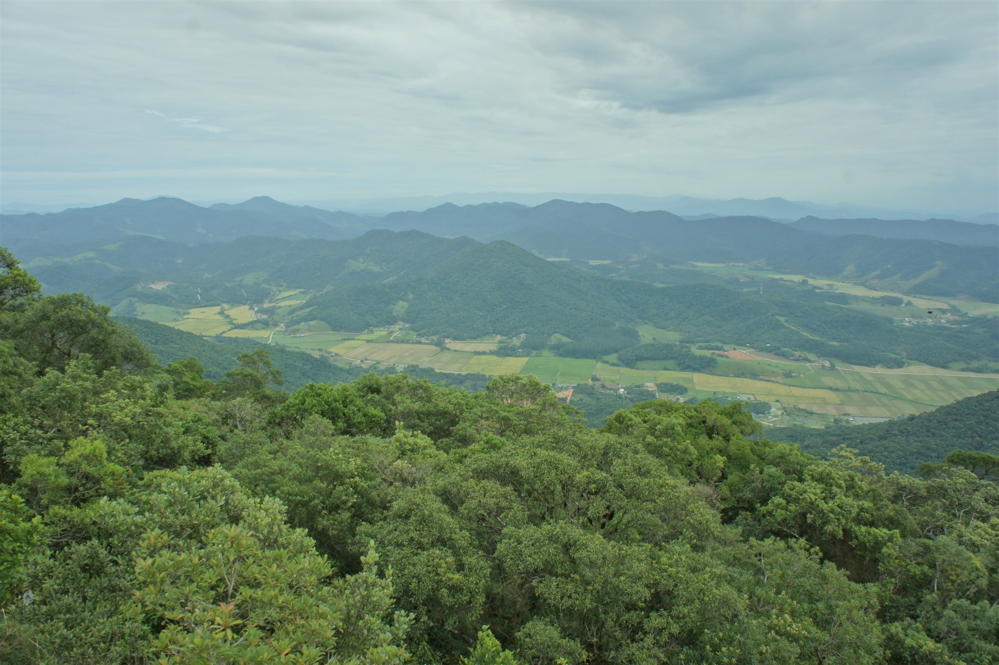

```{r, layout="l-screen-inset", fig.cap="Atlantic Forest landscape in southern Brazil", echo=FALSE}



```

## Olá

<aside>

```{r, echo=FALSE}
library(ggimage)
library(ggplot2)

df.img <- data.frame(x = 1, y = 1, img = "img/ID.JPG")

ggplot(df.img, aes(x = x, y = y )) + geom_image(aes(image=img), size=0.6, asp = 1.6) +
  theme_void() +
  theme(panel.background = element_rect(fill = "#FAF8F4", color = "#FAF8F4"))
```

</aside>

<p style=" font-size:10pt">

*English below*

</p>

Eu sou Arthur. Sou [doutorando em Ecologia](https://www.ufrgs.br/leff/). Eu tenho desenvolvido pesquisa em ecologia de comunidades, macroecologia e macroevolução. Meu interesse principal é ecologia vegetal e minhas pesquisas têm focado na região da Mata Atlântica.

Aqui compartilho [textos](https://avrodrigues.github.io/blog.html), [minhas pesquisas](https://avrodrigues.github.io/pub.html) e algumas ideias em [visualização de dados](https://avrodrigues.github.io/tidy_tuesday.html).

Eu adoro programar em R, sou um entusiasta dos [aplicativos shiny](https://avrodrigues.github.io/shiny.html) e em 2020 comecei a estudar visualização de dados.

Temos interesses em comum? Acha que eu posso te ajudar de alguma forma? Entre em contato comigo: [rodrigues.arthur.v\@gmail.com](mailto:rodrigues.arthur.v@gmail.com){.email}

## Hello

I am Arthur. I'm PhD [student in Ecology](https://www.ufrgs.br/leff/). I have developed research in community ecology, macroecology and macroevolution. My main interest is plant ecology, and my research has focused on the Atlantic Forest region.

Here I share [texts](https://avrodrigues.github.io/blog.html), [my research](https://avrodrigues.github.io/pub.html), and some ideas in [data visualization](https://avrodrigues.github.io/tidy_tuesday.html).

I love to code in R, I am an enthusiast of [shiny apps](https://avrodrigues.github.io/shiny.html) and in 2020 I started to study data visualization.

Do we have interests in common? Can I contribute with you in anyway? Contact me at [rodrigues.arthur.v\@gmail.com](mailto:rodrigues.arthur.v@gmail.com){.email}
