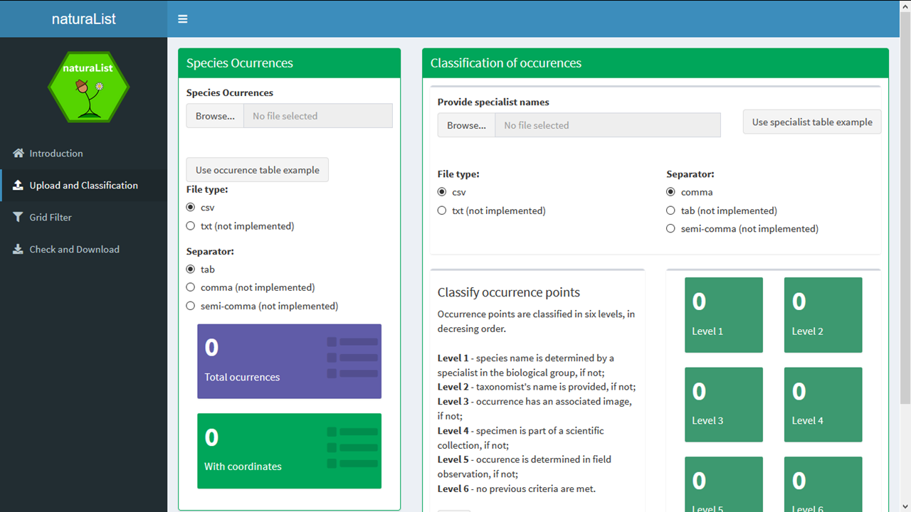
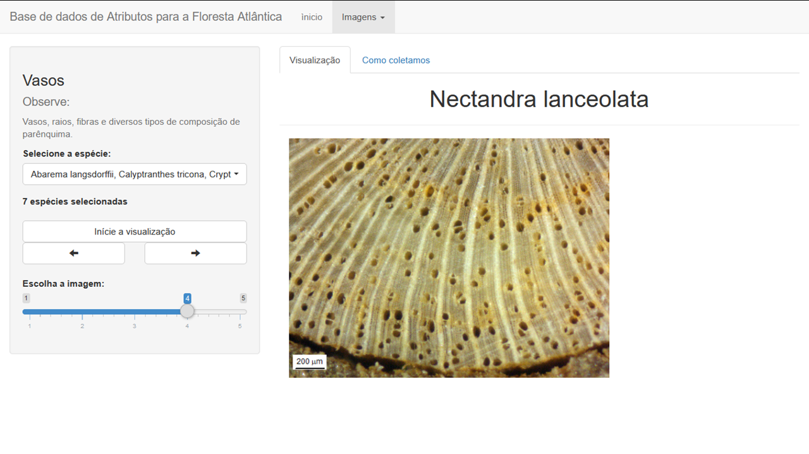

## [naturaList](https://avrodrigues.shinyapps.io/naturaList/)

This app was made for the [2019 GBIF Ebbe Nielsen Challenge](https://www.gbif.org/pt/news/2mixX9oDrJI2W3AqPFOxI3/wherenext-wins-2019-gbif-ebbe-nielsen-challenge) and win the 3rd Prize in this challenge. 

naturaList app provides tools aiming at classify occurrence records based on the confidence in the species identification. To conduct the classification, the user should have an occurrence dataset downloaded from GBIF, and a list of expert taxonomist in the taxon of interest.
The app provides full guideline to conduct the classification and filtering. 

Based on this work, an R package is in development to provide more flexibility on the classification and cleaning of datasets in R. 

## [Plant Traits Dataset](https://avrodrigues.shinyapps.io/AF_plant_trait_dataset/)

This is, for shure, the challenger and the hardest app I have made. Unfortunately, it is unfinished and only in Portuguese.

In this app, my objective was to share the images of wood branches and stomata I shoted for my master thesis project. 

My master thesis was focused in the investigation of plant trait variation in the Atlantic Forest. For that, I collected more that 500 plant individuals, and measure several traits. Some of them were derived from images took from branches and leaves. 

In the app you can view images of the bracnhes, from panoramic view, which enables to contrast area used for wood, bark and pith; and a zoomed view, which enables to see the vessels and other wood elementes in more details. In addition, you can see stomata in the upper side of the leaf from several species.

You can access the paper and the dataset, which include the images showed in the app, in this [link](https://doi.org/10.3390/data3020016).
